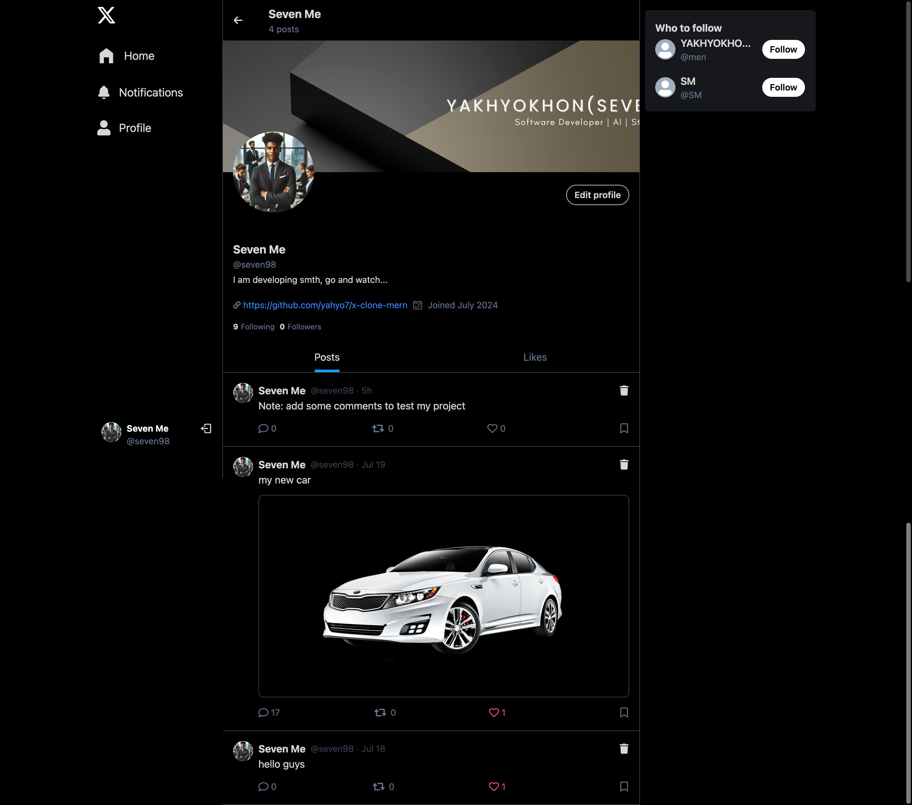

<div align="center">
    <h2>
       MERN Stack X/ex-Twitter Clone
    </h2>
</div>

<div align="center">
    <a href="https://x-clone-mern-ec2v.onrender.com/">
        Live Website on Render
    </a>
</div>




## Features

You can try all features in the live website.

- ⚛️ **Tech Stack:** React.js, MongoDB, Node.js, Express, Tailwind
- 🔐 **Authentication:** JSON Web Tokens (JWT)
- 🔥 **Data Fetching:** React Query for data fetching, caching, and more
- 👥 **User Suggestions:** Suggested users to follow
- ✍️ **Create Posts:** Post creation functionality
- 🗑️ **Delete Posts:** Ability to delete your posts
- 💬 **Commenting:** Comment on posts
- ❤️ **Liking Posts:** Like posts
- 🔒 **Delete Own Posts:** Only the owner can delete their posts
- 📝 **Edit Profile:** Edit your profile information
- 🖼️ **Edit Images:** Change cover image and profile picture
- 📷 **Image Uploads:** Cloudinary integration for image uploads
- 🔔 **Notifications:** Send and receive notifications
- ⏳ **And much more!**

## Setup

1. **Create a `.env` file** in the root directory of the project with the following variables:

    ```env
    MONGO_URI=...
    PORT=...
    JWT_SECRET=...
    NODE_ENV=...
    CLOUDINARY_CLOUD_NAME=...
    CLOUDINARY_API_KEY=...
    CLOUDINARY_API_SECRET=...
    ```

2. **Install Dependencies**

    ```shell
    npm install
    ```

## Build the App

```shell
npm run build
```

## Start the App

```shell
npm run start
